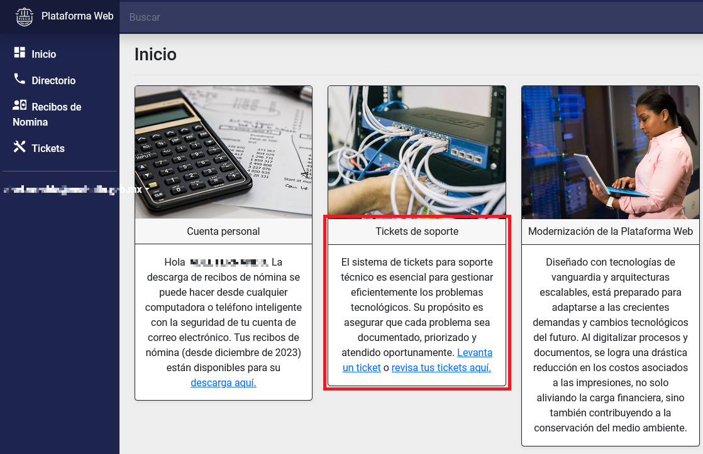
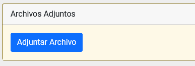
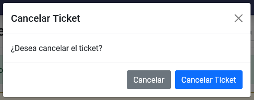

# Creación, Edición y Cancelación de Tickets para usuarios

## Índice

  - [Crear un nuevo ticket](#crear-un-nuevo-ticket)
  - [Adjuntar un archivo a un ticket](#adjuntar-un-archivo-ticket)
  - [Buscar y llegar al detalle de un ticket](#consultar-mis-tickets)
  - [Editar un ticket](#editar-un-ticket)
  - [Cancelar un ticket](#cancelar-un-ticket)

---

## Crear un nuevo ticket

Ingrese a __Plataforma Web__ con una cuenta personal. De esta forma vera los recuadros de inicio como a continuación:

Puede notar el recuadro de Ticket de Soporte e ingresar al __módulo de Tickets__ desde ahí o presionando sobre la opción de tickets del menú principal izquierdo de la página de Plataforma Web.

Después presione el botón de __Nuevo Ticket__ situado en la parte superior derecha de su pantalla.

Esto lo llevará al formulario para la creación del ticket.

Llene los siguientes campos:

  - __Escriba detalladamente el problema__: Aquí deberá escribir lo más detalladamente el problema que presenta, así como incluir todos los datos que se necesitan para resolverlo, como es el caso de una alta de cuenta para un compañero.
  - __Elija una clasificación__: Elija una clasificación según las siguientes opciones:

    - __Soporte Técnico__: Todo problema que tenga que ver con su PC, impresora, conexión a internet.
    - __PAIIJ__: Problemas relacionados con el sistema PAIIJ.
    - __SIGE__: Problemas relacionados con el sistema SIGE.
    - __Otro__: Problemas que no se contemplan en las otras clasificaciones.
    - __Infraestructura__: Problemas con las lamparas, enchufes, mobiliario, etc.

Finalmente presione el botón de __Solicitar soporte__ para enviar el ticket al departamento de soporte técnico.

## Ajuntar un archivo a un ticket

[Ingrese al detalle de un ticket](#ingresar-detalle-ticket), que se encuentre en estado de "SIN ATENDER". Ahí vera en la parte inferior izquierda el listado de 'Archivos Adjuntos' y un el botón de __Adjuntar_Archivo__.

Lo llevará a un formulario para adjuntar un archivo

Llene los campos de:

  - __Descripción del archivo__: Coloque una pequeña descripción de lo que trata el archivo adjunto, ya sea una imagen o un PDF.
  - __Adjunta el archivo ó arrástralo__: Puede hacer clic en está área o arrastrar y dejar caer el archivo a adjuntar.

Después presione el botón de __Subir Archivo__.

## Buscar y llegar al detalle de un ticket

Aquí vera listado todos los tickets que ha creado, y podrá consultar el estado en el que se encuentran.

Los estados que puede tener un ticket:

  - __SIN ATENDER__: Cuando crea un nuevo ticket y aún no se ha atendido.
  - __TRABAJANDO__: Cuando el técnico está trabajando en darle solución a dicho ticket.
  - __CANCELADO__: Cuando el ticket ha sido cancelado por usted mismo. Debido a que el problema ya no se presentó.
  - __CERRADO__: Cuando se dió por finalizado un ticket pero no se pudo resolver de forma exitosa.
  - __TERMINADO__: Cuando un ticket ha sido atendido y resultó con éxito.

Use los botones __Anterior__, __No. de página__ y __Siguiente__ para cambiar la página del listado. Si necesita ver más filas escoja en __Mostrar__ otra cantidad.

Por medio del buscador, escriba en uno o más campos cómo lo quiere filtrar y presione el botón __Lupa__ o __ENTER__ en su teclado. En cambio, el botón __Escoba__ limpia los campos del buscador y deja el listado sin filtros.

Para ingresar al detalle de un ticket, presione sobre el _ID_ del ticket que desea consultar.

Una vez dentro del detalle del ticket, podrá ver toda la información del mismo, como en el siguiente ejemplo:

Listado de los datos de un detalle de un ticket:

  - __Estado__: Estado en el que se encuentra actualmente el ticket. Véase [estados de un ticket](#estados-ticket)
  - __Descripción__: Texto descriptivo del problema que tiene. Esto fue escrito por usted.
  - __Usuario__: Su nombre.
  - __Oficina__: Clave y nombre de su oficina.
  - __Departamento__: Departamento al que pertenece.
  - __Categoría__: Categoría en la que fue clasificado por el personal de soporte.
  - __Técnico__: Nombre del técnico que atendió el ticket.
  - __Resolución__: Fecha y hora en la que el ticket fue resuelto.
  - __Respuesta/Solución__: Texto descriptivo que el técnico le da como respuesta o solución al problema.

Los tickets también cuentan con una sección de 'Archivos Adjuntos', puedo consultarlos ahí.

## Editar un ticket

Si desea hacer cambios a un ticket que se encuentra aun en estado de "SIN ATENDER" puede hacerlo editando el ticket.

[Ingrese al detalle de un ticket](#ingresar-detalle-ticket), que se encuentre en estado de "SIN ATENDER". Ahí vera en la parte superior derecha un el botón de __Editar__.

Lo llevará a un nuevo formulario donde lo único que puede editar es el detalle del problema.

## Cancelar un ticket

Si ya se corrigió el problema o ya no presentó problemas, puede cancelar el ticket para que el equipo de soporte técnico ya no tenga que trabajar en ello.

[Ingrese al detalle de un ticket](#ingresar-detalle-ticket), que se encuentre en estado de "SIN ATENDER". Ahí vera en la parte superior derecha de su pantalla el botón de __Cancelar__.

Después confirme la ventana de advertencia, presionando sobre el botón __Cancelar Ticket__.

