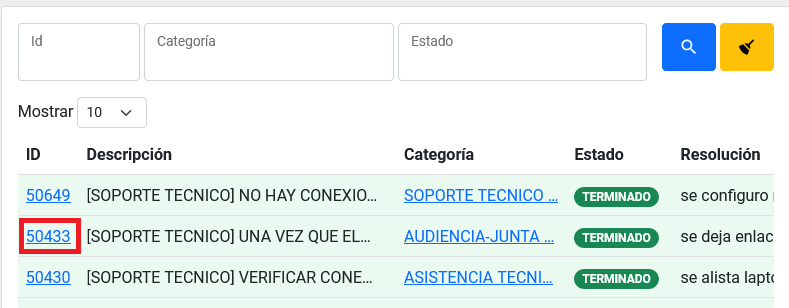
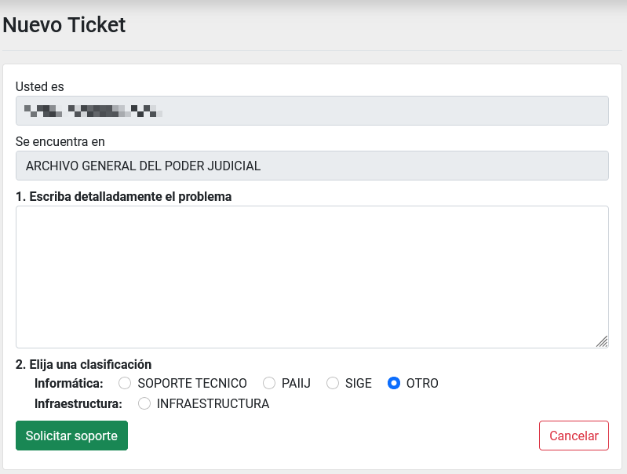

# Creación, Edición y Cancelación de Tickets

## Índice

  - [Consultar mis tickets](#consultar-mis-tickets)
  - [Ingresar al detalle de un ticket](#ingresar-detalle-ticket)
  - [Crear un nuevo ticket](#crear-un-nuevo-ticket)
  - [Cancelar un ticket](#cancelar-un-ticket)
  - [Adjuntar un archivo](#adjuntar-un-archivo)
  - [Editar un ticket](#editar-un-ticket)

---

## Consultar mis tickets

Ingrese al __módulo de Tickets__. Presione sobre la opción de tickets del menú principal izquierdo de la página de Plataforma Web.

Aquí vera listado todos los tickets que ha creado, y podrá ver el estado en el que se encuentran los mismos.

Listado de estados de un ticket:

  - __TERMINADO__: Cuando un ticket ha sido atendido y resulto con éxito.
  - __CANCELADO__: Cuando el ticket ha sido cancelado por usted mismo. Debido a que el problema ya no se presentó.
  - __SIN ATENDER__: Cuando crea un nuevo ticket y aún no se ha atendido.
  - __CERRADO__: Cuando se dió por finalizado un ticket pero no se pudo resolver de forma exitosa.
  - __TRABAJANDO__: Cuando el técnico está trabajando en darle solución a dicho ticket.

Si ya tiene muchos tickets en su listado, puede hacer uso de los filtros de búsqueda, y acortar la lista de ticket.

## Ingresar al detalle de un ticket

Para ingresar al detalle de un ticket, presione sobre el campo de _ID_ del ticket que desea consultar del listado de tickets.

Una vez dentro del detalle del ticket, podrá consultar con más detenimiento los campos que componen el ticket.

Listado de campos de un detalle de un ticket:

  - __Estado__: Estado en el que se encuentra actualmente el ticket. Véase [estados de un ticket](#estados-ticket)
  - __Descripción__: Texto descriptivo del problema que tiene. Esto fue escrito por usted.
  - __Usuario__: Su nombre.
  - __Oficina__: Clave y nombre de su oficina.
  - __Departamento__: Departamento al que pertenece.
  - __Categoría__: Categoría en la que fue clasificado por el personal de soporte.
  - __Técnico__: Nombre del técnico que atendió el ticket.
  - __Resolución__: Fecha y hora en la que el ticket fue resuelto.
  - __Respuesta/Solución__: Texto descriptivo que el técnico le da como respuesta o solución al problema.

Los tickets también cuentan con un apartado de 'Archivos Adjuntos', puedo consultarlos ahí.

## Crear un nuevo ticket

Ingrese al __módulo de Tickets__. Presione sobre la opción de tickets del menú principal izquierdo de la página de Plataforma Web.

Después presione el __botón de Nuevo Ticket__ situado en la parte superior derecha de su pantalla.

Esto lo llevará a una nueva pantalla donde deberá rellenar el formulario para la creación del ticket.

Rellene los siguientes campos:

  - Usted es: Es su nombre completo.
  - Se encuentra en: Es el nombre del departamento al que pertenece.
  - __1. Escriba detalladamente el problema__: Aquí deberá escribir lo más detalladamente el problema que presenta, así como incluir todos los datos que se necesitan para resolverlo, como es el caso de una alta de cuenta para un compañero.
  - __2. Elija una clasificación__: Si conoce realmente de que sistema o a que tipo de problema pertenece, puede eligir el sistema más adecuado.

Finalmente presione el __botón de Solicitar soporte__ para enviar el ticket al departamento de soporte técnico.

## Cancelar un ticket

[Ingrese al detalle de un ticket](#ingresar-detalle-ticket), que se encuentre en estado de "SIN ATENDER". Ahí vera en la parte superior derecha de su pantalla el __botón de Cancelar__.

Así si ya se corrigió el problema o ya no presentó problemas, puede cancelar que el equipo de soporte técnico tenga que trabajar en ello.

## Ajuntar un archivo

[Ingrese al detalle de un ticket](#ingresar-detalle-ticket), que se encuentre en estado de "SIN ATENDER". Ahí vera en la parte inferior izquierda el apartado de 'Archivos Adjuntos' y un el __botón de Adjuntar_Archivo__.

Lo llevará a una nueva pantalla con el formulario para adjuntar un archivo

Rellene el campo de:

  - __Descripción del archivo__: Coloque una pequeña descripción de lo que trata el archivo adjunto, ya sea una imagen o un PDF.
  - __Adjunta el archivo ó arrastralo__: Puede hacer clic en está área o arrastrar y dejar caer el archivo a adjuntar.

Después presione el __botón de Subir Archivo__.

## Editar un ticket

Si desea hacer cambios a un ticket que se encuentra aun en estado de "SIN ATENDER" puede hacerlo editando el ticket.

[Ingrese al detalle de un ticket](#ingresar-detalle-ticket), que se encuentre en estado de "SIN ATENDER". Ahí vera en la parte superior derecha un el __botón de Editar__.

Lo llevará a un nuevo formulario donde lo único que puede editar es el detalle del problema.