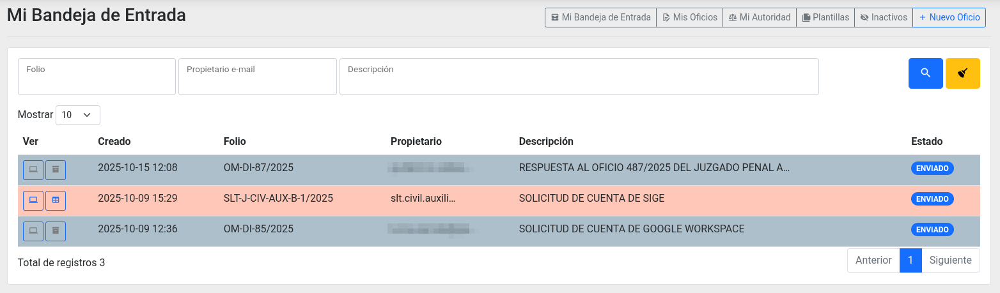
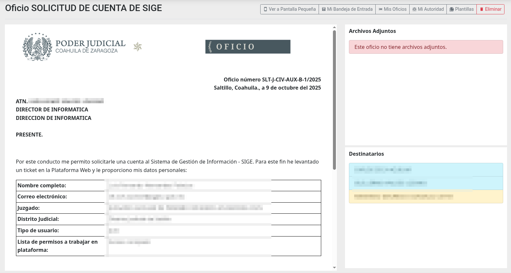
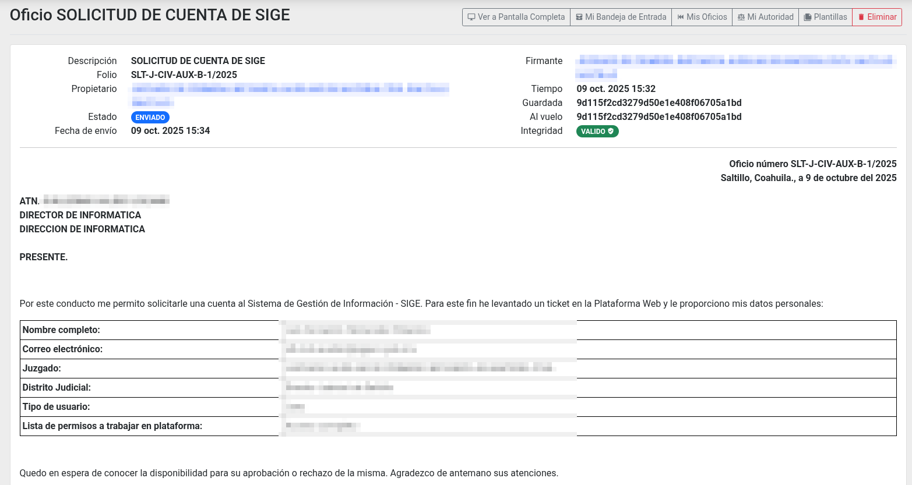

# Plataforma Web - Oficios

## Introducción

Al momento de redactar este manual, los oficios se escriben e imprimen en papel, los cuales son sellados y firmados con firma autógrafa, y cuando los destinatarios son foráneos, son envíados por paquetería. Esto causa altos costos económicos y consume tiempo valioso que merma el desempeño de este medio de comunicación.

El módulo Oficios en Plataforma Web sirve para escribir, firmar, enviar y administrar los oficios que se elaboran y se envían entre los juzgados y las direcciones de nuestra institución. Con su uso, por parte de todos, vamos a alcanzar la meta de “cero papel” en la Ciudad Judicial de Saltillo y en todos los Distritos Judiciales; porque ya no habrá la necesidad de imprimir y enviar físicamente estos documentos.

Además se va a incrementar la eficiencia en la gestión con el uso de plantillas y buscadores, y tendremos más seguridad porque habrá copias de seguridad y mecanismos de control de acceso.

## Mi Bandeja de Entrada

De clic en **Oficios** en el menú principal, le mostrará **Mi Bandeja de entrada** con el listado de los oficios que ha recibido. Los oficios que aún no ha leído aparecerán en negritas.

Puede usar el buscador del listado para escribir en éste parte del folio, la clave de la autoridad, parte de la descripción o elegir el estado, y dar clic en la **lupa** para filtrar sus resultados. De clic en la **escoba** para limpiar los campos.

De clic en el primer icono de la columna **Ver** para abrir el oficio a pantalla completa, o en el segundo icono para abrir el detalle en pantalla pequeña.

## Detalle para Pantalla Completa

Verá la versión digital del oficio con su encabezado, su cuerpo y su pie de página. Del lado derecho superior aparecerán el listado de los archivos adjuntos y del lado derecho inferior el listado de los destinatarios (en azul si no lo ha visto y en verde si ya lo vio).

## Detalle para Pantalla Pequeña

La vista para pantalla pequeña es ideal para teléfonos inteligentes con orientación vertical. El primer cuadro tiene los datos generales y las cadenas de validación, tanto la guardada como la que se genera al momento de abrir, si fuesen diferentes significaría que el contenido ha sido cambiado después de la firma electrónica. El segundo cuadro tiene el cuerpo del oficio, seguido por las listas de los destinatarios y de los archivos adjuntos.

